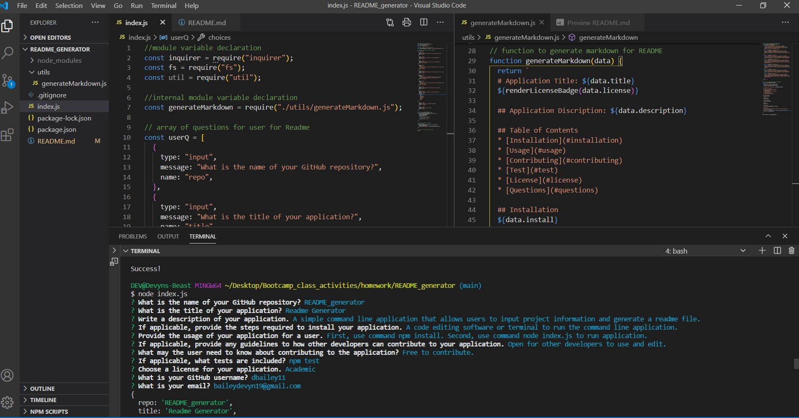

  # Application Title: Readme Generator
  License Documentation: (https://opensource.org/licenses/AFL-3.0)
    

  ## Application Discription: A command line application using Node.js. Allows users to input project descripts and get back a project readme.

  ## Table of Contents
  * [Installation](#installation)
  * [Usage](#usage)
  * [Contributing](#contributing)
  * [Test](#test)
  * [License](#license)
  * [Questions](#questions)
 
  ## Installation 
  npm install and either a code editing software or terminal

  ## Usage
  Use node index.js to start application

  ## Screenshot
  

  ## Contributing
  Will need to work on a seperate branch and add commits/comments.

  ## Test
  npm test

  ## License
  License Documentation: (https://opensource.org/licenses/AFL-3.0)
    

  ## Questions
  * If you have any questions please feel free to email me or stop by on my GitHub! 
  * Find me on GitHub: (https://github.com/dbailey11/)
  * Email me: baileydevyn19@gmail.com
